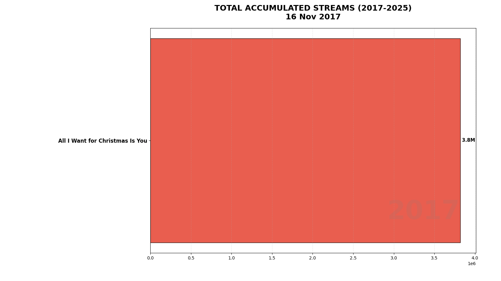
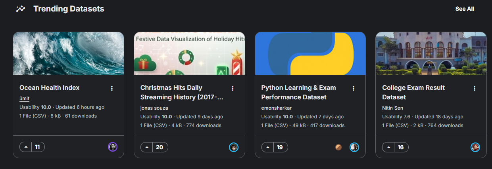

# Christmas Songs Spotify Streaming Analysis (2017-2025)


## Overview

This project presents a comprehensive analysis of streaming patterns for 7 classic Christmas songs on Spotify between 2017 and 2025. Using data science and visualization techniques, we investigate temporal trends, seasonality, and the evolution of these songs' popularity during the holiday season.

## Analyzed Songs

1. All I Want for Christmas Is You - Mariah Carey
2. Last Christmas - Wham!
3. Rockin' Around the Christmas Tree - Brenda Lee
4. Jingle Bell Rock - Bobby Helms
5. Santa Tell Me - Ariana Grande
6. It's Beginning to Look a Lot Like Christmas - Michael Bublé
7. Feliz Navidad - José Feliciano

## Repository Structure

```
Christmas_Songs_Spotify_Analysis/
├── data/
│   └── raw/
│       └── spotify_christmas_streams_kworb_2017_2025.csv
├── notebooks/
│   ├── 01_data_collection.ipynb
│   ├── 02_exploratory_data_analysis.ipynb
│   ├── 03_temporal_analysis.ipynb
│   └── 04_prediction_models.ipynb
├── images/
│   ├── animations/
│   ├── data_collection/
│   ├── exploratory_analysis/
│   ├── temporal_analysis/
│   └── prediction_models/
├── reports/                                      # 📄 
│   ├── relatorio_analise_spotify_PT.pdf         # Portuguese PDF report
│   ├── spotify_streaming_analysis_report_EN.pdf # English PDF report
├── scripts/
│   └── create_animations.py
├── extract_images.py
├── README.md
├── LICENSE
└── .gitignore
```

## 📄 Professional Reports

Comprehensive analysis reports available in both Portuguese and English:

### 🇧🇷 Portuguese Version (Versão em Português)
**PDF Report:** [relatorio_analise_spotify_PT.pdf](reports/relatorio_analise_spotify_PT.pdf) - 24 páginas

### 🇺🇸 English Version
**PDF Report:** [spotify_streaming_analysis_report_EN.pdf](reports/spotify_streaming_analysis_report_EN.pdf) - 24 pages

### 📋 Report Contents
Both versions include:
- **Executive Summary** - Key findings and highlights
- **Introduction** - Context, objectives, and analyzed songs
- **Methodology** - Data collection process, tools, and technologies
- **Exploratory Data Analysis** - Descriptive statistics, distributions, and peak identification
- **Temporal Analysis** - Time series, seasonal patterns, CAGR, and growth trends
- **Predictive Models** - ARIMA(1,1,1) model selection, validation, and 2025 forecasts
- **Conclusions** - Main findings, limitations, and future work
- **17 Professional figures** and **10 detailed tables**

> **Note:** LaTeX source files (.tex) are available locally but excluded from version control via .gitignore.

## Animated Visualizations

### Streaming Evolution Race
Watch the competition unfold as songs accumulate total streams from 2017 to 2025:



### Weekly Seasonal Growth Pattern
See how streaming patterns evolve week by week during the Christmas season:


## Analyses Performed

### 1. Data Collection
**Notebook:** `01_data_collection.ipynb`

- Web scraping from Kworb.net
- Historical streaming data extraction (2017-2025)
- Data processing and structuring
- Weekly granularity (Thursday updates)


### 2. Exploratory Data Analysis
**Notebook:** `02_exploratory_data_analysis.ipynb`

Descriptive statistics per song:
- Mean, median, and standard deviation of weekly streams
- Coefficient of variation (CV%)
- Peak and outlier identification
- Frequency distribution

**Key Findings:**
- "All I Want for Christmas Is You" leads with 1.77 billion total streams
- All songs reached their peaks in Week 52 of 2024 (December 26)
- Average coefficient of variation of 64%, indicating high seasonality

_by_song_2017_-_nov_2025.png)

.png)

### 3. Temporal Analysis
**Notebook:** `03_temporal_analysis.ipynb`

Time series analyses:
- Complete time series evolution (2017-2025)
- Seasonal patterns of the Christmas cycle (weeks 45-52 + week 1)
- Annual trend analysis with CAGR
- Year-over-year (YoY) growth
- Temporal heatmap (year × week)

**Key Findings:**
- CAGR of 23.34% (2017-2024)
- Exponential growth during weeks 48-52
- Sharp decline after week 1 (January)
- 2024 showed the highest historical peaks

_(only_shows_weeks_when_song_was_in_top_200_global).png)

_(weeks_45-52_+_week_1,_only_when_songs_were_in_top_200_global).png)

### 4. Predictive Models
**Notebook:** `04_prediction_models.ipynb`

#### Model Comparison: ARIMA vs Linear Regression

This analysis implements and compares two forecasting approaches:

**Why Two Models?**
- **ARIMA(1,1,1)** initially chosen for time series forecasting
- **Linear Regression** added as simpler alternative after observing ARIMA convergence issues

**ARIMA Limitations Identified:**
- Multiple convergence warnings during training
- Over-parameterization: 3-4 parameters competing for only 6-8 annual data points
- Artificial time series structure (8 years per week) not ideal for complex autocorrelation modeling
- Differencing component (d=1) reduces already small dataset further

**Linear Regression Advantages:**
- Simple trend modeling: exactly what we need for year-over-year growth
- Only 2 parameters (intercept + slope) vs 3-4 for ARIMA
- No convergence issues - analytical solution via least squares
- Robust performance even with small samples
- Easy interpretation: "each year, streams grow by X millions"

**Comparative Results:**

| Metric | ARIMA | Linear Regression | Winner |
|--------|-------|-------------------|--------|
| **Validation MAPE (2024)** | 16.0% | 15.4% | **LR** ✓ |
| **Songs Won (out of 7)** | 3 | 4 | **LR** ✓ |
| **2025 Total Forecast** | 1,723.40M | 1,696.55M | Similar |
| **Convergence Issues** | Yes | No | **LR** ✓ |
| **Interpretability** | Medium | High | **LR** ✓ |

**Key Findings:**
- Linear Regression marginally outperforms ARIMA (15.4% vs 16.0% MAPE)
- LR wins on 4/7 songs, particularly "Last Christmas" (+10.8% improvement) and "All I Want for Christmas Is You" (+4.9%)
- ARIMA better for "It's Beginning to Look a Lot Like Christmas" (+11.0%), suggesting recent momentum shifts benefit from autocorrelation
- Both models show comparable reliability (~15-16% MAPE)
- **Conclusion**: Linear Regression chosen as final model due to simplicity, stability, and adequate accuracy without convergence complications

**2025 Season Forecasts (Linear Regression):**
- Predicted total growth of ~10-12% for top songs
- "It's Beginning to Look a Lot Like Christmas" shows highest growth (+29.9%)
- "Feliz Navidad" strong growth potential (+11.5%)
- Only "Jingle Bell Rock" predicted to decline (-2.7%)

**ARIMA Model Results:**


%20Forecast%20Christmas%20Songs%202025%20Season.png)

**Linear Regression Model Results:**


**Model Comparison:**


## How to Run

### Prerequisites

```bash
pip install pandas numpy matplotlib seaborn jupyter beautifulsoup4 requests lxml tabulate
```

### Running the Notebooks

1. Clone the repository:
```bash
git clone https://github.com/your-username/Christmas_Songs_Spotify_Analysis.git
cd Christmas_Songs_Spotify_Analysis
```

2. Start Jupyter Notebook:
```bash
jupyter notebook
```

3. Run the notebooks in order:
   - `01_data_collection.ipynb` - Data collection
   - `02_exploratory_data_analysis.ipynb` - Exploratory analysis
   - `03_temporal_analysis.ipynb` - Temporal analysis
   - `04_prediction_models.ipynb` - Predictive models

## Key Results

### Popularity Ranking (Total Streams 2017-2025)

1. All I Want for Christmas Is You - 1.77 billion
2. Last Christmas - 1.50 billion
3. Rockin' Around the Christmas Tree - 1.16 billion
4. Jingle Bell Rock - 1.03 billion
5. Santa Tell Me - 1.01 billion
6. It's Beginning to Look a Lot Like Christmas - 927 million
7. Feliz Navidad - 633 million

### Seasonal Pattern

- **Start (Weeks 45-47)**: Gradual growth (8-11M streams/week)
- **Acceleration (Weeks 48-50)**: Exponential growth (15-24M streams/week)
- **Peak (Weeks 51-52)**: Maximum peak (27-39M streams/week)
- **Decline (Week 1)**: Sharp drop to 8-9M streams/week

### Annual Growth

- Compound Annual Growth Rate (CAGR): **23.34%**
- Consistent growth from 2017 to 2024
- 2024 established new historical records for all songs

## Dataset Limitations

- Data available only when songs are in Spotify's Global Top 200
- Gaps between February and October (off-season period)
- Weekly granularity (not daily)
- 2025 with partial data (until November 28)

## Technologies Used

- **Python 3.x**: Main language
- **Pandas**: Data manipulation and analysis
- **NumPy**: Numerical computing
- **Matplotlib**: Data visualization
- **Seaborn**: Statistical visualizations
- **Jupyter Notebook**: Development environment
- **BeautifulSoup**: Web scraping
- **Requests**: HTTP requests

## Data Source

**Kworb.net** - Spotify streaming tracking platform
- URL: https://kworb.net/spotify/
- Method: Web scraping
- Period: 01/01/2017 - 11/28/2025

## Recognition

This dataset was featured in **Kaggle's Trending Datasets**, demonstrating the community's interest in music streaming analytics and seasonal patterns analysis.



## Author

**Jonas Souza**

Electrical Engineer

## License

This project is under the MIT license. See the LICENSE file for more details.

---

**Note**: This is an educational analysis project and demonstration of data science skills. Data is collected from public sources for study purposes.
